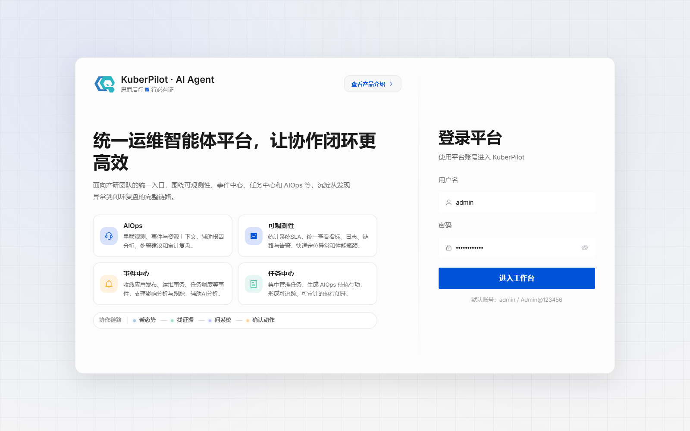
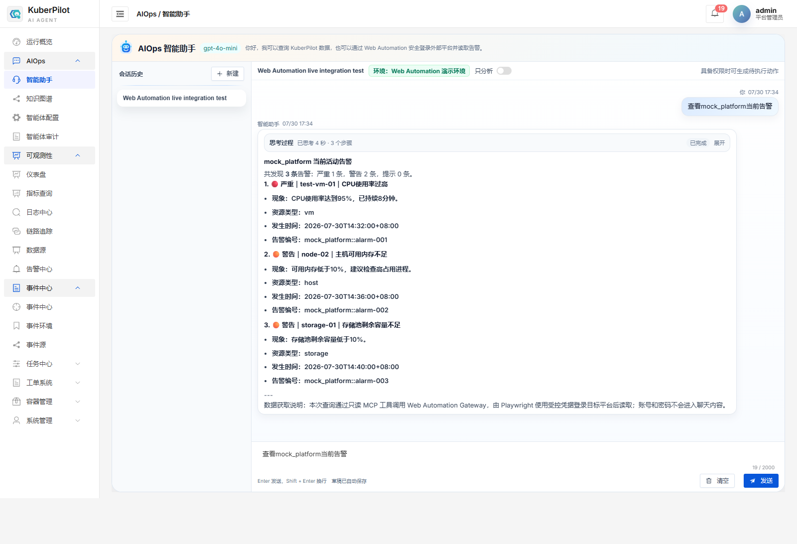
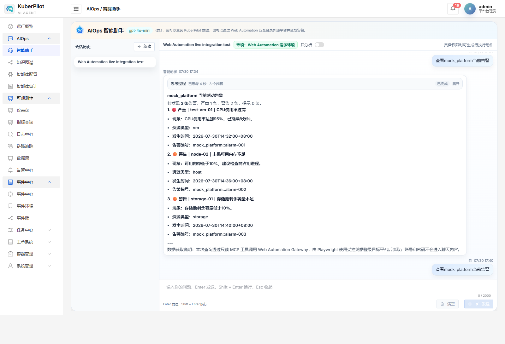
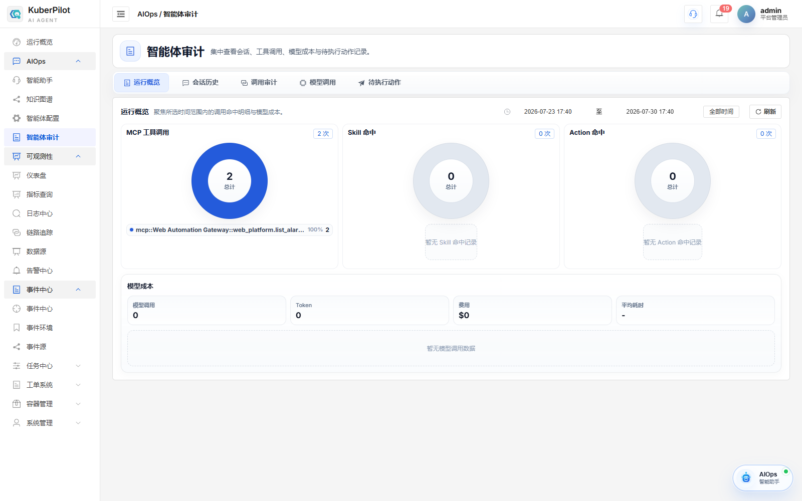

# AIOps Web Automation 告警闭环实现说明

## 1. 文档目的

本文记录 KuberPilot Web Automation 告警查询闭环的实现方式、运行链路、验证结果
与安全边界。

实现效果：

> 管理员登录 KuberPilot，在 AIOps 智能助手中输入“查看mock_platform当前告警”，智能体通过 MCP 调用 Web Automation Gateway。Gateway 使用受控账号启动真实浏览器、登录模拟运维平台、读取受保护告警接口，再将标准化告警交给 KuberPilot，用中文展示并留下审计记录。

`mock_platform` 是仓库中真实运行的 FastAPI 测试平台，提供登录页、会话 Cookie、
告警页和需要登录才能访问的告警接口。平台数据属于本地演示数据，不代表真实业务
环境或生产联调结果。

## 2. 实现基线

告警闭环实现基于已完成的网络预检能力：

| 指标 | 基线状态 | 证据 |
| --- | --- | --- |
| Gateway 健康检查 | 通过 | `/healthz` 返回 `ok` |
| HTTP 平台连通性 | 通过 | DNS、TCP、HTTP 三阶段成功 |
| 私有 CA HTTPS | 通过 | 自签发测试 CA 可被显式信任 |
| MCP 健康工具 | 通过 | `web_platform.health` 调用成功 |
| 自动化测试 | 25 项通过 | 网络预检测试结果 |
| 部署边界 | 已明确 | Gateway 靠近 KuberPilot 部署，通过网络访问目标平台 |

这些指标只证明“路通了”，没有证明 Gateway 会登录平台、获取业务数据，也没有在 KuberPilot 前端形成用户可见的功能。

## 3. 目标与验收标准

### 3.1 目标

实现以下完整链路：

```text
用户自然语言
  -> KuberPilot Action/快速路由
  -> MCP 客户端
  -> Web Automation Gateway
  -> 凭据提供器
  -> Playwright 浏览器登录
  -> 目标平台受保护告警接口
  -> 标准告警模型
  -> KuberPilot 中文回答
  -> 工具调用审计
```

### 3.2 验收标准

1. 用户必须通过 KuberPilot 正常登录页进入系统。
2. 在 AIOps 前端输入指定问题后，页面显示 `mock_platform` 的 3 条告警。
3. 告警至少包含级别、资源、标题、现象、时间和编号。
4. 查询必须经过 `web_platform.list_alarms` MCP 工具，而不是前端写死数据。
5. Gateway 必须使用 Playwright 登录受保护平台，未登录时不能直接取得告警。
6. 账号和密码不能出现在聊天消息、MCP 参数和工具审计中。
7. 智能体审计页能看到成功的 MCP 工具调用。
8. 无外部大模型 API Key 时，本地演示仍能稳定完成。

## 4. 设计方法

### 4.1 为什么拆成四层

| 层 | 职责 | 不负责什么 |
| --- | --- | --- |
| KuberPilot Agent | 理解入口、选择工具、展示结果、记录审计 | 不保存目标平台明文密码 |
| MCP Gateway | 暴露稳定工具协议、做连通性预检和错误收敛 | 不把网页细节暴露给大模型 |
| 平台 Adapter | 知道某个平台如何登录、从哪里读取告警、如何转换字段 | 不决定聊天文案 |
| Credential Provider | 按 `credential_id` 在内部取得账号密码 | 不将密码放入 MCP 请求 |

这样更换真实平台时，主要新增一个 Adapter 和一份平台定义，不需要重写 KuberPilot 聊天页面。

### 4.2 MCP 在这条链路中的实际作用

MCP 本身不直接点击网页。它负责约定“有哪些工具、每个工具需要什么参数、返回什么结果”。

告警查询调用格式如下：

```json
{
  "tool": "web_platform.list_alarms",
  "arguments": {
    "platform": "mock_platform",
    "limit": 20
  }
}
```

Gateway 收到符合约定的参数后调用 Python Adapter。Adapter 再控制 Playwright
浏览器填写用户名、密码、点击登录并读取数据。各层职责如下：

> AI 或确定性路由负责生成符合工具 Schema 的参数；MCP 服务端把参数交给 Python
> 函数；Python 函数负责执行网络请求或浏览器操作。

当前实现保留确定性自然语言路由，使本地环境在未配置大模型时仍可验证完整链路；
配置模型后，智能体也可以通过 Tool Calling 选择同一个 MCP 工具。

## 5. 实现过程

### 5.1 扩展模拟目标平台

修改 `web_automation/mock_platform/app.py`：

- 增加 HTML 登录页和表单提交；
- 使用随机会话令牌和 `HttpOnly` Cookie；
- 增加 Dashboard 与告警页面；
- 增加受登录保护的 `/api/internal/alarms`；
- 提供 3 条不同严重级别和资源类型的演示告警。

### 5.2 增加凭据隔离

新增 `web_automation/credentials/`：

- MCP 输入只传 `platform`，不传用户名和密码；
- 平台定义只保存 `credential_id`；
- Credential Provider 在 Gateway 内部根据环境变量取得密码；
- 仅在明确打开本地 mock 开关时允许使用演示默认账号。

### 5.3 增加浏览器平台适配器

新增 `web_automation/adapters/mock_platform.py`：

1. 启动系统已安装的 Microsoft Edge；
2. 尝试复用项目内 `.runtime/browser-state` 的登录状态；
3. 如果接口返回 401，则打开登录页；
4. 填写受控账号并提交；
5. 保存会话状态到项目内部；
6. 读取受保护告警接口；
7. 转换为 `StandardAlarm`。

选择系统 Edge 是为了避免额外下载约 180 MB 的 Chromium。Playwright 的临时目录、会话文件和缓存均定向到仓库内部。

### 5.4 增加 MCP 告警工具

新增 `web_automation/gateway/mcp/alarm_tool.py`：

- 工具名：`web_platform.list_alarms`；
- 参数：平台、严重级别、最大条数；
- 只读调用前先做网络连通性检查；
- 成功返回标准告警和严重级别统计；
- 失败返回安全错误码，不回显凭据。

### 5.5 接入 KuberPilot 智能体

修改 `backend/aiops/services.py`：

- 识别同时包含平台名和告警意图的问题；
- 在原有内置告警列表路由之前，优先选择外部平台告警路由；
- 从 MCP 工具注册表中查找 `web_platform.list_alarms`；
- 使用 KuberPilot 原有 `_run_tool_call` 执行，自动生成工具审计；
- 将标准告警渲染成稳定、易读的中文回答；
- 这条只读快速路径不依赖外部 LLM，因此本地可独立验证。

新增管理命令：

```powershell
python manage.py setup_web_automation_demo
```

该命令可重复执行，会自动完成：

- 注册 `Web Automation Gateway`；
- 设置 HTTP MCP 地址 `http://127.0.0.1:8010/mcp`；
- 只启用健康检查和告警查询两个工具；
- 明确 `allow_write: false`；
- 创建 `Web Automation 演示环境` 及 `mock_platform` 别名；
- 将指定问题加入智能体建议问题。

### 5.6 修复本地真实后端登录模式

原前端在本地开发环境会自动进入“纯前端预览模式”，使用 `preview-token` 请求真实后端会得到 401。

修改 `frontend/src/utils/preview.js` 后：

- 本地开发默认连接真实后端；
- 只有显式访问 `?preview=1` 才进入纯前端预览；
- `?preview=0` 可清除已经保存的预览状态。

这项修改是浏览器真实端到端验证能够成立的必要条件。

## 6. 如何运行

以下命令从仓库根目录开始执行，并使用两个 PowerShell 终端分别保持服务运行。

### 6.1 终端一：启动模拟平台和 Gateway

```powershell
Set-Location ".\web_automation"
Set-ExecutionPolicy -Scope Process Bypass
.\scripts\start-local-demo.ps1
```

该终端保持运行。Gateway 地址为 `http://127.0.0.1:8010`，模拟平台地址为 `http://127.0.0.1:8011`。

### 6.2 终端二：初始化并启动 KuberPilot

```powershell
Set-Location ".\backend"
python manage.py setup_web_automation_demo
Set-Location ".."
Set-ExecutionPolicy -Scope Process Bypass
.\tools\dev\start-dev.ps1
```

初始化命令可幂等执行；开发脚本启动后端 `http://127.0.0.1:8000` 和前端
`http://127.0.0.1:3000`。

### 6.3 页面操作

1. 打开 `http://127.0.0.1:3000/login`；
2. 使用 `admin / Admin@123456` 登录；
3. 进入“AIOps → 智能助手”；
4. 输入 `查看mock_platform当前告警`；
5. 等待页面出现 3 条告警；
6. 进入“AIOps → 智能体审计”，检查 MCP 调用。

## 7. 自动化测试与检验结果

### 7.1 自动化结果

| 检验项 | 结果 |
| --- | --- |
| Web Automation 单元/集成测试 | 29 项通过 |
| KuberPilot 新增路由、格式化、初始化命令测试 | 3 项通过 |
| Vue 生产构建 | 通过，2191 个模块完成转换 |
| Gateway 本地 E2E | 3 条告警，Playwright 登录采集成功 |
| KuberPilot 服务层真实 MCP 调用 | 通过，生成 1 条工具调用审计 |
| 浏览器端到端操作 | 通过，4 张截图全部生成 |

### 7.2 浏览器操作证据

#### 步骤一：真实 KuberPilot 登录页



对应本文第 6.3 节第 1～2 步，证明不是纯后端接口测试。

#### 步骤二：在智能助手中输入目标问题



对应本文第 3 节目标和第 6.3 节第 3～4 步。

#### 步骤三：前端显示外部平台告警



对应本文第 5.3～5.5 节。页面显示：

- `test-vm-01` CPU 使用率过高，严重；
- `node-02` 可用内存不足，警告；
- `storage-01` 存储容量不足，警告；
- 数据获取方式说明为只读 MCP + Playwright 受控登录。

#### 步骤四：智能体审计记录 MCP 调用



对应本文第 3.2 节第 4、7 条。审计页显示
`mcp::Web Automation Gateway::web_platform.list_alarms` 调用成功。

## 8. 安全边界

- 当前实现只开放只读工具，`allow_write` 为 `false`；
- 用户名和密码不属于 MCP 参数；
- 日志、聊天内容和审计只记录平台及工具名；
- 浏览器会话保存在 Git 忽略的 `.runtime` 目录；
- 真实生产环境不得使用 mock 默认密码；
- “确认、关闭或处理告警”等写操作不属于当前实现；扩展此类能力时必须接入
  KuberPilot Pending Action 和人工确认，不能直接复用只读路径执行。

## 9. 当前限制

当前实现完成“可见、可运行、可审计”的本地技术闭环，不代表生产平台接入。
尚未验证真实平台认证、验证码、MFA、SSO、页面改版、正式 Secret 管理和写操作。

## 10. 总结

在网络可达性验证的基础上，当前实现增加了凭据隔离、浏览器登录、告警采集、
标准化、MCP 暴露、智能体路由、中文展示和审计，形成了可在 KuberPilot 前端
使用的 Web Automation 功能。

该实现验证了一条可复用于不同运维平台的接入骨架：KuberPilot、MCP 和标准数据
合同保持稳定，平台差异由平台定义与 Adapter 隔离。
