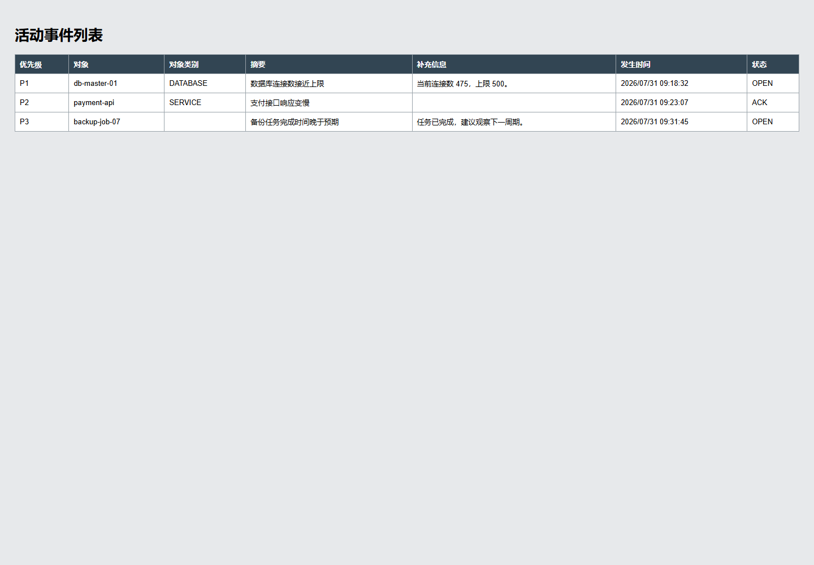
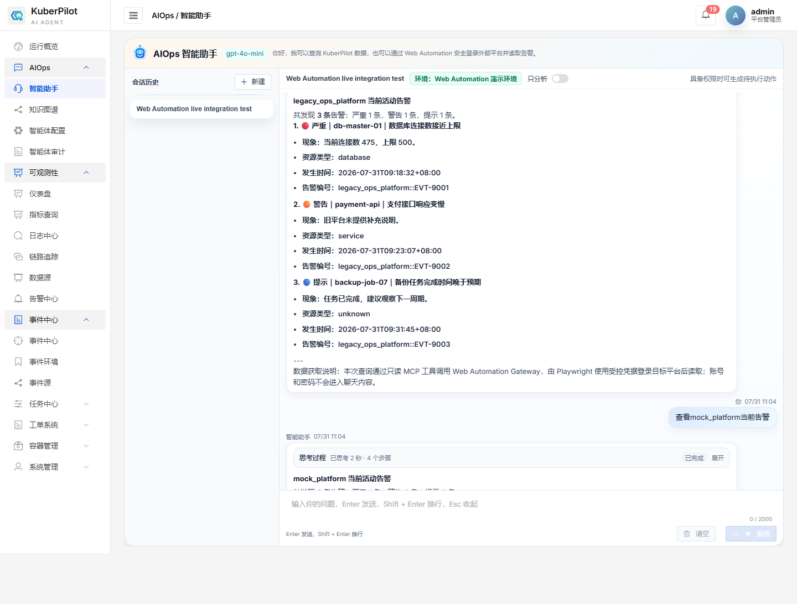
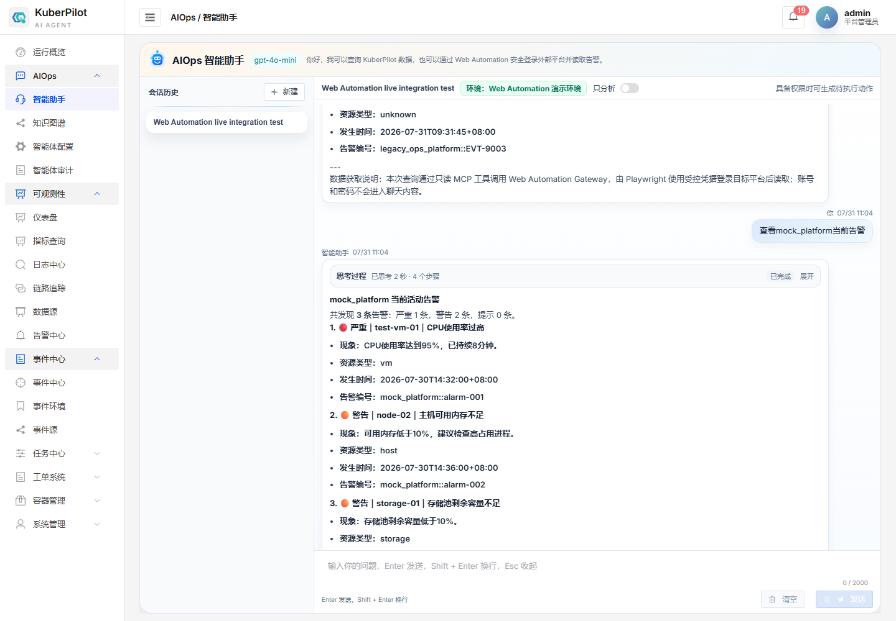
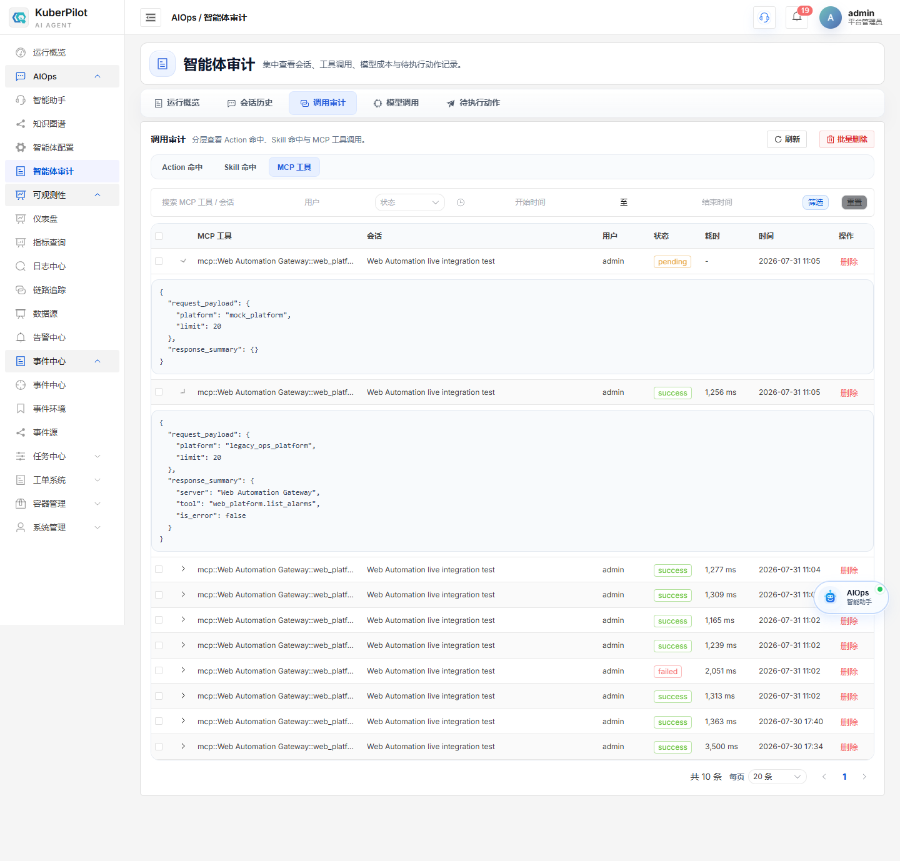

# AIOps Web Automation 多平台泛化验证说明

## 1. 背景与实现基线

多平台验证建立在已完成的单平台告警链路之上：

> 用户在智能助手输入“查看mock_platform当前告警” → KuberPilot 调用
> `web_platform.list_alarms` → Gateway 使用 Playwright 登录 MockOps →
> 读取受保护的 JSON 告警接口 → 转换成 `StandardAlarm` → 前端显示中文结果并记录审计。

这证明了“一个平台可以接通”，但还不能证明方案具有泛化能力。原有
`mock_platform` 的告警获取依赖 JSON API；如果只是再复制一份相同接口和数据，
仍然无法回答“换成页面结构、字段和登录方式都不同的平台，是否还能接入”。

当前实现新增第二个差异化测试平台，用于验证平台差异能否被 Adapter 隔离，而
KuberPilot 前端、MCP 工具名和标准告警模型保持不变。

## 2. 目标、范围与验收标准

### 2.1 目标

实现 `legacy_ops_platform` Adapter。用户在同一个 KuberPilot 智能助手中分别输入：

```text
查看legacy_ops_platform当前告警
查看mock_platform当前告警
```

两次请求都应通过同一个 MCP 工具得到结构统一的中文告警结果，并留下可区分目标
平台的调用审计。

### 2.2 范围与非目标

验证范围包括：

- 第二个可独立运行的本地测试平台；
- 不依赖告警 API、直接解析登录后 HTML 表格的 Adapter；
- P1/P2/P3、非 ISO 时间、缺失字段和平台状态的标准化；
- KuberPilot 自然语言平台选择；
- 两个平台共用一个 MCP 工具和同一套前端展示；
- 自动测试、本地 MCP 集成测试、浏览器端到端验收和截图。

验证范围不包括：

- 经授权的真实运维平台联调；
- 验证码、短信、单点登录等复杂认证；
- 对外部平台执行写操作；
- 生产级密钥管理和高可用部署。

因此，当前结论是“两个差异化本地平台的泛化验证通过”，不是“所有真实平台
均可零开发接入”。

### 2.3 验收标准

| 编号 | 验收标准 | 证据 | 结论 |
|---|---|---|---|
| 1 | 第二平台要求登录且告警只存在于 HTML 表格 | 平台集成测试、截图 1 | 通过 |
| 2 | Adapter 将 P1/P2/P3、旧时间格式和缺失字段转成 `StandardAlarm` | 单元测试与 MCP 返回 | 通过 |
| 3 | 同一个 `web_platform.list_alarms` 可查询两个平台 | `verify_local.py` 返回两个平台各 3 条 | 通过 |
| 4 | KuberPilot 能从问题中选择正确平台 | Django 4 项测试 | 通过 |
| 5 | 同一前端页面可展示两个平台结果 | 截图 2、截图 3 | 通过 |
| 6 | MCP 审计能区分 `platform` 参数且不记录密码 | 截图 4 | 通过 |
| 7 | 原 `mock_platform` 能力没有被破坏 | 32 项 WebAutomation 测试与浏览器回归 | 通过 |
| 8 | 前端生产构建可完成 | Vite 构建，2191 个模块转换成功 | 通过 |

## 3. 方案与关键决策

### 3.1 两个平台为什么要故意设计得不同

| 差异 | `mock_platform` | `legacy_ops_platform` |
|---|---|---|
| 登录地址 | `/login` | `/auth/signin` |
| 登录字段 | 用户名、密码 | 操作员工号、访问口令 |
| 登录成功页 | `/dashboard` | `/console` |
| 告警来源 | 受保护 JSON API | 登录后的 HTML 表格 |
| 级别 | critical/warning/info | P1/P2/P3 |
| 时间 | ISO 8601 | `YYYY/MM/DD HH:mm:ss` |
| 字段完整性 | 字段较完整 | 部分说明、资源类型为空 |
| 状态 | firing | OPEN/ACK |

这些差异模拟了真实项目常见情况：新平台可能有内部 API，旧平台往往只有页面；
不同厂商对级别、时间和字段的定义也不一样。

### 3.2 统一链路

```text
用户问题
  ↓ 提取管理员已注册的平台标识
KuberPilot AIOps
  ↓ 同一个工具：web_platform.list_alarms
Web Automation Gateway
  ↓ 根据 YAML 中的 adapter 字段选择实现
┌────────────────────────┬──────────────────────────────┐
│ MockPlatformAdapter    │ LegacyOpsPlatformAdapter     │
│ 登录后读取 JSON API    │ 登录后解析 HTML 表格         │
└────────────────────────┴──────────────────────────────┘
  ↓ 两边都转换成 StandardAlarm
同一套中文格式化、前端展示和 MCP 审计
```

关键边界：

- AI 只能传已注册的 `platform`、`severity`、`limit`，不能传任意 URL；
- URL、Adapter 和 `credential_id` 由管理员 YAML 控制；
- 用户名、密码由 Gateway 的凭据提供器解析，不进入 MCP 参数或聊天内容；
- 当前链路保持只读，不产生 Pending Action 或外部写操作。

## 4. 实施过程与文件变更

| 文件或目录 | 修改内容 | 修改原因 |
|---|---|---|
| `web_automation/legacy_ops_platform/` | 新增旧式登录页、控制台、HTML 告警表和会话失效测试入口 | 提供与原平台结构明显不同的第二测试环境 |
| `web_automation/adapters/legacy_ops_platform.py` | Playwright 登录、表格解析、字段映射和默认值处理 | 把平台差异封装在独立 Adapter |
| `web_automation/platforms/definitions/legacy-ops-platform.yaml` | 注册 URL、Adapter、凭据引用和允许网段 | 平台目标由管理员配置，不让 AI 指定 URL |
| `web_automation/gateway/mcp/alarm_tool.py` | 注册第二 Adapter | 保持同一 MCP 工具按配置分派 |
| `web_automation/credentials/environment.py` | 增加第二本地测试凭据引用 | 验证多平台凭据隔离 |
| `backend/aiops/services.py` | 新增平台别名提取，按用户问题传入目标平台 | 取消 fast path 对 `mock_platform` 的写死 |
| `setup_web_automation_demo.py` | 增加第二建议问题和环境别名 | 启动后可直接看到两个测试入口 |
| `web_automation/scripts/verify_local.py` | 同时启动、调用并核验两个平台；支持截图参数 | 形成可重复的一键集成验收 |
| `capture_multi_platform_e2e.py` | 自动执行登录、两次提问、审计查看和截图 | 让浏览器证据可以重新生成 |
| `web_automation/tests/`、`backend/aiops/test_web_automation.py` | 新增旧平台会话、标准化和路由测试 | 覆盖成功、登录保护、会话失效和缺失字段 |

## 5. 运行方法

### 5.1 前置条件

- KuberPilot 后端、前端依赖已经安装；
- `web_automation/.venv` 已创建；
- 本机安装 Microsoft Edge；
- 所有命令在仓库内运行，缓存和临时文件仍放在项目目录。

### 5.2 启动 Web Automation

在第一个 PowerShell 终端：

```powershell
Set-Location ".\web_automation"
Set-ExecutionPolicy -Scope Process Bypass
.\scripts\start-local-demo.ps1
```

该脚本启动：

- Gateway：`http://127.0.0.1:8010`
- MockOps：`http://127.0.0.1:8011`
- Legacy NOC：`http://127.0.0.1:8012`
- 私有 CA 测试服务：`https://127.0.0.1:8443`

### 5.3 启动 KuberPilot

第二个终端从仓库根目录执行：

```powershell
Set-Location ".\backend"
python manage.py setup_web_automation_demo
Set-Location ".."
Set-ExecutionPolicy -Scope Process Bypass
.\tools\dev\start-dev.ps1
```

打开 `http://127.0.0.1:3000`，使用本地演示账号登录，然后进入
“AIOps → 智能助手”依次查询两个平台。

### 5.4 自动验证和截图复现

后端、前端已运行时执行：

```powershell
Set-Location ".\web_automation"
.\scripts\run-tests.ps1
.\.venv\Scripts\python.exe .\scripts\verify_local.py
.\.venv\Scripts\python.exe .\scripts\verify_local.py --capture-browser
```

`--capture-browser` 会真实打开无头 Edge 完成页面流程，并覆盖本报告使用的四张
验收截图。

## 6. 验证过程与结果

### 6.1 自动测试

```text
WebAutomation：32 passed
KuberPilot aiops.test_web_automation：4 tests, OK
前端构建：2191 modules transformed，built successfully
```

WebAutomation 测试包括：

- 原网络预检与安全 URL 策略；
- 两个平台登录保护；
- 错误密码不创建会话；
- 旧平台会话失效；
- P2 → warning、ACK → acknowledged；
- 空资源类型和空补充说明的默认值；
- 两个平台配置加载和 MCP 调用回归。

### 6.2 本地多组件集成

`verify_local.py` 实际启动 Gateway、两个 HTTP 平台和私有 CA HTTPS 平台，并通过
MCP 调用真实 Playwright Adapter。关键结果：

```json
{
  "alarm_tool_is_error": false,
  "alarm_count": 3,
  "legacy_alarm_tool_is_error": false,
  "legacy_alarm_count": 3,
  "legacy_first_alarm": "legacy_ops_platform::EVT-9001"
}
```

这比单元测试多验证了 Gateway、网络预检、凭据解析、浏览器登录、Adapter 分派和
MCP 返回之间的真实协作。

## 7. 浏览器验证与截图

### 7.1 第二平台确实只有 HTML 告警表

浏览器登录 Legacy NOC 后展示旧式活动事件表。页面使用 P1/P2/P3、旧时间格式，
并存在空字段；它不是复制原平台 JSON API。



### 7.2 智能体查询第二平台

输入 `查看legacy_ops_platform当前告警` 后，智能体显示 3 条标准告警。原页面的
P1/P2/P3 已转换成严重/警告/提示，空说明被替换成易懂默认文案。



### 7.3 同一会话查询两个不同平台

不更换前端页面、不更换 MCP 工具，继续输入 `查看mock_platform当前告警`。
截图上半部分保留旧平台回答结尾，下半部分显示 MockOps 告警，证明两个 Adapter
共用同一条智能体链路。



### 7.4 MCP 调用审计

展开审计详情可看到请求参数分别包含 `mock_platform` 和
`legacy_ops_platform`，但没有用户名、密码或 Cookie。截图中也保留了开发过程中
失败/进行中的历史记录；这说明审计页没有只展示成功结果，最终通过状态以
自动测试、MCP 返回和两张前端结果截图共同确认。



## 8. 安全、配置与兼容性

- 两个平台使用不同 `credential_id`，模型输入不包含凭据；
- Adapter 目标来自 YAML，不能通过提示词绕过到任意 URL；
- 网络检查仍限制解析后的 CIDR，防止把工具当任意地址访问器；
- MCP 工具仍为只读；
- 浏览器状态保存在仓库内被忽略的 `.runtime/browser-state`；
- 本地测试密码仅服务于代码内模拟平台，不是生产秘密；
- PowerShell 脚本保持 UTF-8 with BOM，并已通过语法解析；
- 中文源码、配置和文档使用 UTF-8。

## 9. 已知限制、风险与未验证项

1. 两个平台都是本地可控测试平台，不等于真实厂商平台联调。
2. Adapter 依赖页面选择器；真实平台升级页面后需要契约检测和维护。
3. 当前会话失效由平台集成测试覆盖，但尚未实现采集过程中自动重登重试。
4. 没有覆盖验证码、MFA、SSO、跨域 iframe 和动态虚拟表格。
5. 环境变量凭据提供器适合本地实验；生产应接密钥管理服务。
6. 当前只读取告警。确认、关闭、派单等写操作必须走 Pending Action 和人工确认。

## 10. 总结

当前实现把 KuberPilot Web Automation 从“单平台可用”推进到“两个结构明显不同的
本地平台可通过统一接口接入”。第二平台不是增加几条假告警，而是使用不同登录
契约、HTML 数据源、字段语义和时间格式，最终仍转换为同一个 `StandardAlarm`。

现有证据达到“本地多组件集成 + 浏览器端到端验证”层级，可以作为
Adapter 泛化思路的阶段性技术验证；经授权的真实平台联调和生产环境验证不在当前
结论范围内。
