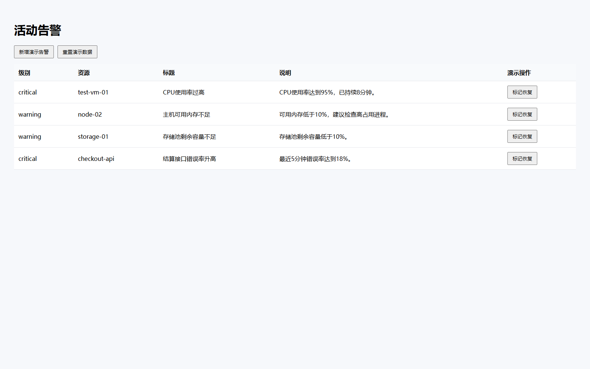
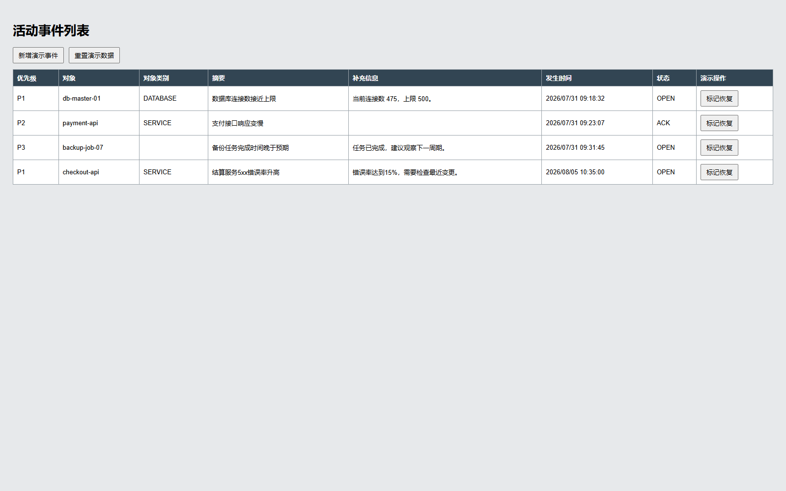
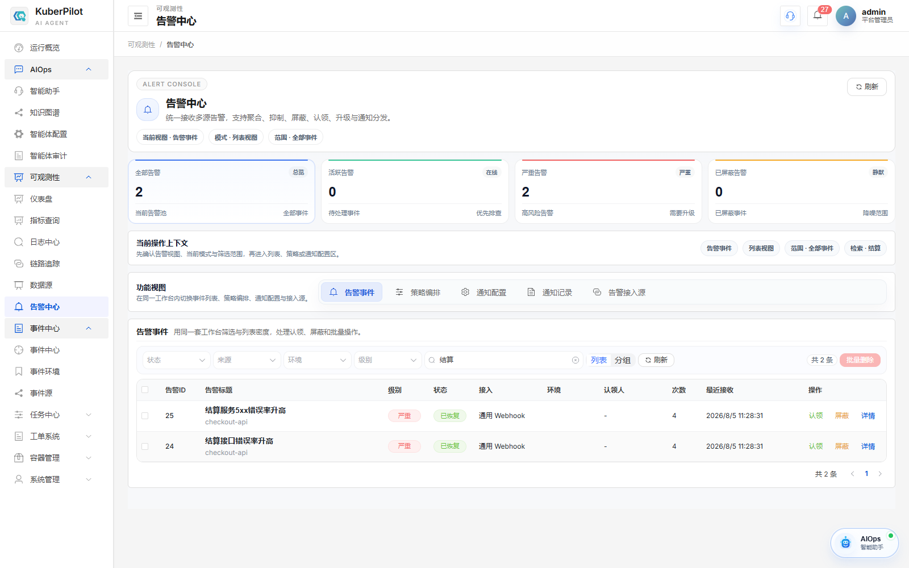

# AIOps Web Automation 告警增量闭环实现说明

本文说明 KuberPilot Web Automation 在 P1-1 周期采集基础上完成的 P1-2 告警增量闭环。
当前版本能够比较相邻两次采集结果，识别新增、持续和恢复告警，并通过带服务令牌的
专用回调接口写入 KuberPilot 既有告警中心。重复采集不会反复创建同一告警，源平台
告警消失后，同一条 KuberPilot 告警会更新为“已恢复”。

当前证据等级为本地单元测试、多组件集成测试和浏览器端到端验证。两个源平台仍是
仓库内的 MockOps 与 Legacy NOC 演示平台，尚未完成真实运维平台或生产环境验证。

## 1. 背景与修改前状态

P1-1 已实现按平台配置的周期采集、任务状态流转、SQLite 任务历史和任务查询 API。
但每次任务只保存当次全量采集结果，系统还不能判断一条告警是第一次出现、仍在持续，
还是已经从源平台消失，也没有把变化主动写入 KuberPilot 告警中心。

本次实现对应 `AIOPS_WebAutomation_Design.md` 的以下内容：

- §16.3：增量采集、状态快照和差异检测；
- §16.4：回调、失败重试与不丢失快照；
- §17.4：任务结果中的增量统计和投递结果；
- §19.1 P1：稳定周期采集、增量去重和恢复事件的原型闭环。

## 2. 目标、范围与验收标准

### 2.1 目标

把“每分钟得到一份全量告警列表”推进为“只把有意义的告警变化送入 KuberPilot”，
并让用户能在现有告警中心看到新增告警和恢复状态。

### 2.2 本次范围

- 为每个平台保存上一次成功投递后的活动告警快照；
- 使用稳定指纹比较本次与上次结果，区分 `new`、`ongoing`、`recovered`；
- 只回调新增与恢复事件，持续告警不重复投递；
- 复用 KuberPilot 既有 `Alert`、`AlertIntegration`、通用告警标准化和告警中心页面；
- 增加 Web Automation 专用回调端点，强制校验服务令牌；
- 回调失败时按配置重试，全部失败后任务标记为失败且不推进快照；
- 在两个演示平台增加仅限本地、登录后可用的新增与恢复按钮；
- 在任务结果中记录新增、持续、恢复、投递数和投递尝试次数。

### 2.3 非目标

- Redis/RQ/Celery 分布式队列、跨实例锁和死信队列；
- Prometheus 指标、Grafana 看板与自动告警；
- 真实平台写操作或自动处置；
- 真实平台、7×24 或生产负载稳定性验证；
- 把演示控制按钮开放到非本地环境。

### 2.4 验收结果

| 编号 | 验收标准 | 证据 | 结论 |
|---|---|---|---|
| 1 | 首次出现的告警识别为新增并回调 | 两个平台均为 `new=1, delivered=1` | 通过 |
| 2 | 持续告警不重复创建 | 周期结果为 `ongoing=3, delivered=0` | 通过 |
| 3 | 源平台告警消失后更新为恢复 | 两个平台均为 `recovered=1, delivered=1` | 通过 |
| 4 | 新增与恢复使用同一 KuberPilot 记录 | 总数保持 8，2 条记录转为 `resolved` | 通过 |
| 5 | 回调必须携带有效令牌 | 缺失/错误令牌 403，正确令牌 202 | 通过 |
| 6 | 回调失败可重试且不错误推进快照 | Callback 与 Processor 单元测试 | 通过 |
| 7 | P0/P1-1 能力无回归 | Web Automation 全量测试 56 项 | 通过 |
| 8 | KuberPilot 接入及前端构建无回归 | Django 定向 18 项、Vue 构建 | 通过 |

## 3. 方案设计

### 3.1 完整链路

```text
APScheduler 周期触发
  → CollectionTaskManager 复用 Adapter 采集 StandardAlarm
  → AlarmChangeProcessor 读取该平台上次快照
  → AlarmDiffer 计算 new / ongoing / recovered
  → 仅将 new / recovered 交给 CallbackClient
  → 携带服务令牌调用 KuberPilot 专用 webhook
  → KuberPilot 通用告警标准化与 fingerprint upsert
  → 现有告警中心显示活动或已恢复
  → 全部投递成功后替换快照并完成任务
```

### 3.2 指纹、去重与恢复

每条标准化告警使用“平台标识 + 平台告警编号”计算稳定指纹。相邻两次快照比较规则：

- 本次有、上次没有：`new`；
- 两次都有：`ongoing`；
- 上次有、本次没有：`recovered`。

新增和恢复事件使用相同指纹。KuberPilot 的 `upsert_alert` 因此更新同一数据库记录，
不会把恢复事件误建成第二条告警。

### 3.3 回调失败策略

默认重试间隔为 10、30、90 秒，可在本地环境变量中调整。只有本轮全部变化都投递
成功后才替换快照；若投递失败，任务保存 `CALLBACK_DELIVERY_FAILED` 并保留旧快照。
下一个周期仍会重新识别和投递这些变化，避免“回调失败但系统误以为已经送达”。

当前重试发生在 Gateway 进程内，不等同于持久化队列或死信队列。

### 3.4 凭据边界

`configure-web-automation-callback.ps1` 在本地生成随机令牌，把它写入被 Git 忽略的
`web_automation/.env`，并用同一令牌配置 KuberPilot 的 `AlertIntegration`。脚本不会
输出令牌。Gateway 只向固定的专用地址发送回调；缺少、伪造或已禁用令牌均返回 403。

## 4. 实施内容与代码位置

| 文件或目录 | 实现内容 |
|---|---|
| `web_automation/gateway/alerts/differ.py` | 指纹生成、快照索引和新增/持续/恢复判断 |
| `web_automation/gateway/alerts/callback.py` | KuberPilot 回调数据转换、令牌请求和重试 |
| `web_automation/gateway/alerts/processor.py` | 组织差异计算、投递和成功后快照更新 |
| `web_automation/gateway/tasks/store.py` | 新增平台告警快照表及原子替换 |
| `web_automation/gateway/tasks/manager.py` | 定时任务成功采集后执行增量处理 |
| `web_automation/gateway/config.py` | 回调开关、地址、令牌、超时和重试间隔校验 |
| `web_automation/gateway/dependencies.py` | 按配置装配 CallbackClient 和 Processor |
| `backend/ops/views.py`、`backend/ops/urls.py` | Web Automation 专用令牌回调端点 |
| `backend/aiops/management/commands/setup_web_automation_demo.py` | 幂等配置告警集成及本地令牌 |
| `web_automation/mock_platform/app.py` | MockOps 登录后新增、恢复和重置演示告警 |
| `web_automation/legacy_ops_platform/app.py` | Legacy NOC 登录后新增、恢复和重置演示事件 |
| `tools/dev/configure-web-automation-callback.ps1` | 生成本地令牌并同步 Gateway/KuberPilot 配置 |
| `web_automation/tests/`、`backend/*/tests/` | 差异、快照、回调、重试、权限和端到端接口测试 |

## 5. 运行与验证方法

### 5.1 配置回调

在仓库根目录执行：

```powershell
Set-Location "<仓库根目录>"
Set-ExecutionPolicy -Scope Process Bypass
.\tools\dev\configure-web-automation-callback.ps1
```

### 5.2 启动服务

终端一：

```powershell
Set-Location "<仓库根目录>"
.\tools\dev\start-dev.ps1
```

终端二：

```powershell
Set-Location "<仓库根目录>\web_automation"
.\scripts\start-local-demo.ps1
```

访问地址：

- KuberPilot：`http://127.0.0.1:3000`
- KuberPilot 告警中心：`http://127.0.0.1:3000/alerts`
- MockOps：`http://127.0.0.1:8011/login`
- Legacy NOC：`http://127.0.0.1:8012/auth/signin`
- Gateway 任务 API：`http://127.0.0.1:8010/docs`

### 5.3 浏览器验收步骤

1. 登录 MockOps 和 Legacy NOC，分别进入活动告警/事件页面；
2. 点击“新增演示告警”或“新增演示事件”；
3. 等待下一个 60 秒采集周期；
4. 打开 KuberPilot 告警中心并搜索“结算”，确认出现两条活动告警；
5. 回到两个源平台点击“标记恢复”；
6. 再等待一个采集周期，刷新 KuberPilot，确认同两条记录显示“已恢复”。

## 6. 验证证据

### 6.1 自动化结果

```text
Web Automation 全量：56 passed，1 条第三方 TestClient 弃用警告
Django Web Automation 与告警 webhook 定向回归：18 tests，OK
Vue 生产构建：2203 modules transformed，built successfully
```

### 6.2 最终多组件联调

使用最终专用回调地址完成一次完整新增与恢复循环：

```text
MockOps 新增：new=1, ongoing=3, delivered=1, delivery_attempts=1
Legacy NOC 新增：new=1, ongoing=3, delivered=1, delivery_attempts=1
MockOps 恢复：recovered=1, ongoing=3, delivered=1, delivery_attempts=1
Legacy NOC 恢复：recovered=1, ongoing=3, delivered=1, delivery_attempts=1
KuberPilot：Web Automation 告警共 8 条，活动 6 条，已恢复 2 条
```

### 6.3 浏览器截图

MockOps 中新增的活动告警：



Legacy NOC 中新增的活动事件：



KuberPilot 告警中心收到两条活动告警：


源平台恢复后，KuberPilot 中同两条记录变为已恢复：



## 7. 安全、兼容性与已知限制

- 回调令牌只保存在本地忽略文件或部署环境，不提交 Git；
- 演示控制端点默认关闭，只有显式设置开关且用户已登录时才可访问；
- 回调只处理标准化告警，不传递平台密码、Cookie 或浏览器会话；
- P0 的手动 MCP 查询不触发增量回调，避免用户查询改变后台告警状态；
- 当前 SQLite 适合单机原型。联调时曾在并发写入瞬间观察到一次本地 SQLite 锁竞争，
  重试刷新后恢复；生产部署应使用项目生产数据库并进行并发验证；
- 当前没有持久化重试队列、死信队列、Prometheus 指标和真实平台长期验证；
- 演示平台的数据和按钮只用于验证机制，不能作为真实平台接入完成的证据。

## 8. 总结

P1-2 将 P1-1 的周期全量采集扩展为可见的告警状态闭环：Gateway 能识别新增、持续和
恢复变化，只投递有意义的事件；KuberPilot 复用既有告警模型和页面完成去重写入及
恢复更新；服务令牌、失败重试和“成功后才推进快照”补上了基础可靠性与安全边界。
该成果已经在两个结构不同的本地演示平台上通过端到端验证，但仍属于单实例技术原型。
